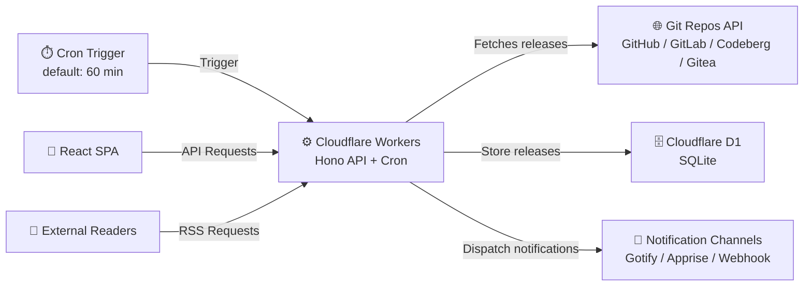

# SRRM — Serverless Repository Release Monitor

> Track releases across multiple Git repositories in one place.  
> Delivers a unified RSS feed and a clean web UI — powered entirely by Cloudflare Workers, and D1. No server to manage.

[](LICENSE)
[](https://nodejs.org)
[](https://workers.cloudflare.com)

[中文 README](README.zh-CN.md)

---

## How It Works



**Data flow:**

1. A Cloudflare Cron Trigger fires at a configured interval (default: 60 min).
2. The Worker fetches new releases from tracked repositories on multiple provider, currently support: **GitHub, GitLab, Codeberg (Forgejo), and Gitea**.
3. New releases are stored in D1 and dispatched to configured notification channels (Gotify / Apprise / Webhook).
4. The React SPA reads releases via the Worker API and renders a timeline.
5. A public RSS feed is available for external readers.

---

## Tech Stack

| Layer | Technology |
|---|---|
| **API / Backend** | [Hono](https://hono.dev) on Cloudflare Workers |
| **Frontend** | React 18 + Vite + Tailwind CSS |
| **Routing** | React Router v6 |
| **Data Fetching** | TanStack React Query |
| **State** | Zustand |
| **Auth** | OAuth2 / OIDC SSO + JWT (HttpOnly Cookie) |
| **Scheduling** | Cloudflare Cron Triggers |
| **Storage** | Cloudflare D1 (SQLite) |
| **Supported Platforms** | GitHub · GitLab · Codeberg (Forgejo) · Gitea |
| **Notifications** | RSS 2.0 · Gotify · Apprise · Webhook |

---

## Prerequisites

- **Node.js** ≥ 18 and **pnpm** ≥ 8
- A **Cloudflare account** with Workers and D1 enabled
- [Wrangler CLI](https://developers.cloudflare.com/workers/wrangler/install-and-update/) installed and authenticated (`wrangler login`)
- An **OIDC-compatible SSO provider**

---

## Deployment

### 1. Clone and install

```bash
git clone https://github.com/yonzilch/srrm.git
cd srrm
pnpm install
```

---

### 2. Create the D1 database

```bash
wrangler d1 create srrm-db
```

Copy the `database_id` from the output — you'll need it in the next step.

Run the schema migration:

```bash
wrangler d1 execute srrm-db \
  --file=apps/worker/src/db/schema.sql \
  --remote
```

---

### 3. Configure `wrangler.toml`

Open `apps/worker/wrangler.toml` and fill in your values.

---

### 4. Register the OIDC callback URL

In your OIDC provider, add the following as an allowed redirect URI:

```
https://srrm.example.com/api/auth/callback
```

---

### 5. Deploy

>SRRM uses a single Worker + Static Assets architecture. Cloudflare Workers natively supports serving static assets (GA), no need for Cloudflare Pages.

```bash
pnpm run deploy
```

This builds the React SPA, then deploys the Worker with static assets and Cron triggers in one step.

**Architecture** — everything runs on a single Worker, one domain:

```
srrm.example.com
    ├── /api/*     → Hono (API + auth)
    ├── /feed.xml  → RSS feed
    └── /*         → React SPA (static assets)
```

For a preview deployment (separate URL, non-production):

```bash
pnpm run deploy:preview
```

---

### Local development

Create `apps/worker/.dev.vars` with your secrets (this file is gitignored):

> **All variables are listed and configured in `apps/worker/wrangler.toml`.**

> You may get more info from [Cloudflare Workers docs](https://developers.cloudflare.com/workers/wrangler/environments)

Then start both services:

```bash
pnpm run dev:worker   # http://localhost:8787
pnpm run dev:web      # http://localhost:5173
```

## API Reference

### Public endpoints

| Method | Path | Description |
|---|---|---|
| `GET` | `/api/releases` | Paginated release list, supports date filtering |
| `GET` | `/feed.xml` | RSS 2.0 feed |
| `GET` | `/api/auth/login` | Redirect to SSO provider |
| `GET` | `/api/auth/callback` | SSO callback handler |
| `POST` | `/api/auth/logout` | Invalidate session |
| `GET` | `/api/auth/me` | Returns current user info |

### Admin endpoints (authentication required)

| Method | Path | Description |
|---|---|---|
| `GET` | `/api/admin/repos` | List tracked repositories |
| `POST` | `/api/admin/repos` | Add a repository to track |
| `DELETE` | `/api/admin/repos/:id` | Remove a tracked repository |
| `GET` | `/api/admin/config` | View current configuration |
| `POST` | `/api/admin/scrape/trigger` | Trigger a scrape cycle immediately |
| `GET` | `/api/admin/notify/status` | Show notifier configuration status |
| `POST` | `/api/admin/notify/test` | Send a test notification |

### Web routes

| Path | Description |
|---|---|
| `/` | Release timeline (home) |
| `/feed` | RSS subscription guide |
| `/login` | Login page |
| `/admin` | Repository management |
| `/admin/settings` | Config and notification settings |

---

## Notification Channels

SRRM auto-detects which notifiers are active based on the presence of their environment variables. Each channel operates independently — a failure in one does not affect others.

| Channel | Required variables | Notes |
|---|---|---|
| **[Gotify](https://github.com/gotify/server)** | `GOTIFY_URL`, `GOTIFY_TOKEN` | Simple self-hosted push notifications, written in Go |
| **[Apprise](https://github.com/caronc/apprise)** | `APPRISE_API_URL` | Powerful notification platform supports many services |
| **Webhook** | `WEBHOOK_URL` | Generic HTTP POST; optionally signed with HMAC-SHA256 |

### Adding a custom notifier

1. Create `apps/worker/src/services/notifiers/<name>.ts` implementing the `Notifier` interface:

   ```typescript
   interface Notifier {
     readonly name: string;
     isConfigured(env: Env): boolean;
     send(release: Release, env: Env): Promise<void>;
   }
   ```

2. Register the new notifier in `apps/worker/src/services/notifiers/index.ts`.

---

## Project Structure

```
srrm/
├── apps/
│   ├── worker/          # Hono API, cron, notifiers
│   │   ├── src/
│   │   │   ├── index.ts         # Entry point & route registration
│   │   │   ├── scheduled.ts     # Cron handler (scrape + notify)
│   │   │   ├── middleware/      # Auth middleware
│   │   │   ├── routes/          # auth · releases · admin · feed
│   │   │   └── services/
│   │   │       ├── db.ts        # D1 query layer
│   │   │       ├── github.ts    # GitHub API client
│   │   │       ├── scraper.ts   # Scrape orchestration
│   │   │       └── notifiers/   # gotify · apprise · webhook
│   │   └── wrangler.toml
│   │
│   └── web/             # React SPA
│       └── src/
│           ├── pages/           # Home · Login · Feed · Admin
│           ├── components/      # Timeline, filters, forms
│           ├── hooks/           # useAuth, useReleases
│           └── api/             # Typed API client
│
└── packages/
    └── shared/          # Types and utilities shared between worker and web
        └── src/
            ├── types.ts
            ├── env.ts
            └── markdown.ts
```

---

## License

This project is licensed under the **MIT license**.
See [LICENSE](LICENSE) for more information.
