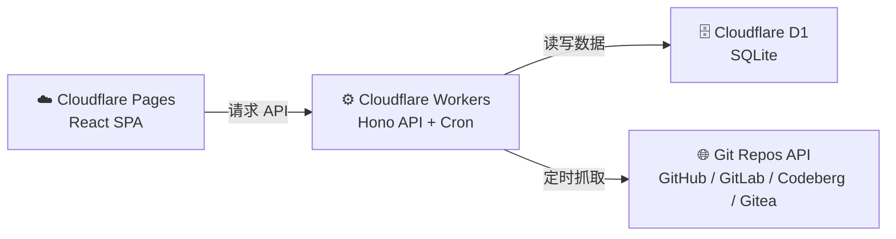

# SRRM — 无服务器仓库发布监控器

> 在一处追踪多个 Git 仓库的发布动态。  
> 提供统一的 RSS 订阅源和简洁的 Web UI —— 完全由 Cloudflare Workers、Pages 和 D1 驱动。无需管理服务器。

[](LICENSE)
[](https://nodejs.org)
[](https://workers.cloudflare.com)

[English README](README.md)

---

## 工作原理



**数据流：**

1. Cloudflare Cron 触发器按配置的间隔（默认：60 分钟）触发。
2. Worker 从多个提供商的被追踪仓库获取新发布版本，目前支持：**GitHub、GitLab、Codeberg (Forgejo) 和 Gitea**。
3. 新发布版本存储在 D1 中，并派发到配置的通知渠道（Gotify / Apprise / Webhook）。
4. React SPA 通过 Worker API 读取发布版本并渲染时间线。
5. 提供公开的 RSS 订阅源供外部阅读器使用。

---

## 技术栈

| 层级 | 技术 |
|---|---|
| **API / 后端** | Cloudflare Workers 上的 [Hono](https://hono.dev) |
| **前端** | React 18 + Vite + Tailwind CSS |
| **路由** | React Router v6 |
| **数据获取** | TanStack React Query |
| **状态管理** | Zustand |
| **认证** | OAuth2 / OIDC SSO + JWT (HttpOnly Cookie) |
| **调度** | Cloudflare Cron Triggers |
| **存储** | Cloudflare D1 (SQLite) |
| **支持平台** | GitHub · GitLab · Codeberg (Forgejo) · Gitea |
| **通知** | RSS 2.0 · Gotify · Apprise · Webhook |

---

## 前置条件

- **Node.js** ≥ 18 且 **pnpm** ≥ 8
- 一个启用了 Workers、D1 和 Pages 的 **Cloudflare 账户**
- 已安装并完成认证的 [Wrangler CLI](https://developers.cloudflare.com/workers/wrangler/install-and-update/)（`wrangler login`）
- 一个具有 `public_repo` 权限（若需访问私有仓库则为 `repo` 权限）的 **GitHub 个人访问令牌 (PAT)**
- 一个 **兼容 OIDC 的 SSO 提供商**

---

## 部署

### 1. 克隆并安装

```bash
git clone https://github.com/yonzilch/srrm.git
cd srrm
pnpm install
```

---

### 2. 创建 D1 数据库

```bash
wrangler d1 create srrm-db
```

从输出中复制 `database_id` —— 下一步会用到。

运行 Schema 迁移：

```bash
wrangler d1 execute srrm-db \
  --file=apps/worker/src/db/schema.sql \
  --remote
```

---

### 3. 配置 `wrangler.toml`

打开 `apps/worker/wrangler.toml` 并填入你的配置值。

---

### 4. 注册 OIDC 回调 URL

在你的 OIDC 提供商中，将以下地址添加为允许的重定向 URI：

```
https://srrm.example.com/api/auth/callback
```

---

### 5. 部署

> SRRM 采用单 Worker + 静态资产架构。Cloudflare Workers 原生支持提供静态资产服务（GA），无需使用 Cloudflare Pages。

```bash
pnpm run deploy
```

这将构建 React SPA，然后一步完成包含静态资源和 Cron 触发器的 Worker 部署。

**架构** —— 一切都运行在单个 Worker 和单个域名上：

```
srrm.example.com
    ├── /api/*     → Hono (API + 认证)
    ├── /feed.xml  → RSS 订阅源
    └── /*         → React SPA (静态资源)
```

预览部署（独立 URL，非生产环境）：

```bash
pnpm run deploy:preview
```

---

### 本地开发

创建 `apps/worker/.dev.vars` 并填入你的密钥（此文件已被 gitignore 忽略）：

> **所有变量均可在 `apps/worker/wrangler.toml` 中查看和配置。**

> 更多信息请参考 [Cloudflare Workers 文档](https://developers.cloudflare.com/workers/wrangler/environments)

然后启动两个服务：

```bash
pnpm run dev:worker   # http://localhost:8787
pnpm run dev:web      # http://localhost:5173
```

## API 参考

### 公开端点

| 方法 | 路径 | 描述 |
|---|---|---|
| `GET` | `/api/releases` | 分页发布列表，支持日期过滤 |
| `GET` | `/feed.xml` | RSS 2.0 订阅源 |
| `GET` | `/api/auth/login` | 重定向至 SSO 提供商 |
| `GET` | `/api/auth/callback` | SSO 回调处理器 |
| `POST` | `/api/auth/logout` | 使会话失效（登出） |
| `GET` | `/api/auth/me` | 返回当前用户信息 |

### 管理端点（需认证）

| 方法 | 路径 | 描述 |
|---|---|---|
| `GET` | `/api/admin/repos` | 列出已追踪的仓库 |
| `POST` | `/api/admin/repos` | 添加追踪仓库 |
| `DELETE` | `/api/admin/repos/:id` | 移除已追踪的仓库 |
| `GET` | `/api/admin/config` | 查看当前配置 |
| `POST` | `/api/admin/scrape/trigger` | 立即触发抓取周期 |
| `GET` | `/api/admin/notify/status` | 显示通知器配置状态 |
| `POST` | `/api/admin/notify/test` | 发送测试通知 |

### Web 路由

| 路径 | 描述 |
|---|---|
| `/` | 发布时间线（首页） |
| `/feed` | RSS 订阅指南 |
| `/login` | 登录页 |
| `/admin` | 仓库管理 |
| `/admin/settings` | 配置和通知设置 |

---

## 通知渠道

SRRM 根据环境变量的存在与否自动检测哪些通知器处于激活状态。每个渠道独立运行——其中一个失败不会影响其他渠道。

| 渠道 | 必需变量 | 备注 |
|---|---|---|
| **Gotify** | `GOTIFY_URL`, `GOTIFY_TOKEN` | 自托管推送通知 |
| **Apprise** | `APPRISE_API_URL` | 通过 [Apprise](https://github.com/caronc/apprise) 支持 50+ 种服务 |
| **Webhook** | `WEBHOOK_URL` | 通用 HTTP POST；可选择使用 HMAC-SHA256 签名 |

### 添加自定义通知器

1. 创建 `apps/worker/src/services/notifiers/<name>.ts`，实现 `Notifier` 接口：

   ```typescript
   interface Notifier {
     readonly name: string;
     isConfigured(env: Env): boolean;
     send(release: Release, env: Env): Promise<void>;
   }
   ```

2. 在 `apps/worker/src/services/notifiers/index.ts` 中注册新的通知器。

---

## 项目结构

```
srrm/
├── apps/
│   ├── worker/          # Cloudflare Worker — Hono API，定时任务，通知器
│   │   ├── src/
│   │   │   ├── index.ts         # 入口文件与路由注册
│   │   │   ├── scheduled.ts     # Cron 处理器（抓取 + 通知）
│   │   │   ├── middleware/      # 认证中间件
│   │   │   ├── routes/          # auth · releases · admin · feed
│   │   │   └── services/
│   │   │       ├── db.ts        # D1 查询层
│   │   │       ├── github.ts    # GitHub API 客户端
│   │   │       ├── scraper.ts   # 抓取调度
│   │   │       └── notifiers/   # gotify · apprise · webhook
│   │   └── wrangler.toml
│   │
│   └── web/             # Cloudflare Pages — React SPA
│       └── src/
│           ├── pages/           # 首页 · 登录 · 订阅 · 管理
│           ├── components/      # 时间线，过滤器，表单
│           ├── hooks/           # useAuth, useReleases
│           └── api/             # 带类型的 API 客户端
│
└── packages/
    └── shared/          # Worker 和 Web 共享的类型与工具
        └── src/
            ├── types.ts
            ├── env.ts
            └── markdown.ts
```

---

## 许可证

本项目基于 **MIT 许可证** 授权。
查看 [LICENSE](LICENSE) 获取更多信息。
